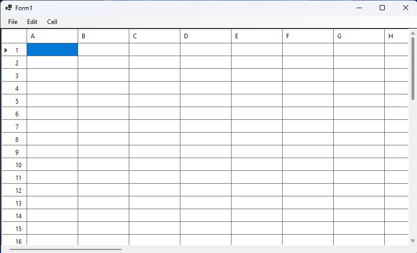
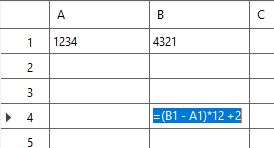
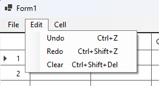
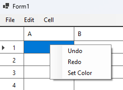
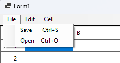
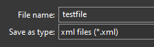
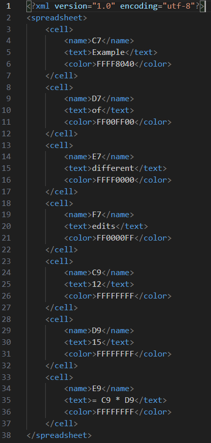
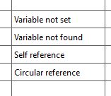

# Spreadsheet Application
### Outline
1. [Overview](#overview)
2. [Features](#features)
    - [Entering values](#entering-values)
    - [Equations](#equations)
    - [Operators](#operators)
    - [Set color](#set-color)
    - [Undo/Redo](#undoredo)   
    - [Saving/Loading](#savingloading)
3. [Error Checking](#error-checking)
    - [Variable not set](#variable-not-set)
    - [Variable not found](#variable-not-found)
    - [Self reference](#self-reference)
    - [Circular reference](#circular-reference)
4. [Unit Testing](#unit-testing)

## Overview
This project was made for CPT_S 321 at Washington State University (WSU) under proffessor Vanera Arnaoudova. 
The application was made in C# utilizing the Winforms library for the .NET 8.0 framework. This project utlized many object oriented programming and C# techniques such as unit testing, the command design pattern, expression trees, delegates, reflection, events, and LINQ. To start the application, navigate to `./Solution/Spreadsheet_Martin_Hundrup/bin/Release/net8.0-windows/Spreadsheet_Martin_Hundrup.exe`.

## Features
### Entering Values
Any cell can be clicked on, and any value can be entered, number or otherwise. The spredsheet will save two seperate values for each [edited] cell: the entered value and the display value. The entered value is exactly what the user entered in, whereas the display value is the calculated value using the entered value. In the case of a `string` or `number` entry such as `hello world!` or `42`, the entered and display values will be the same. Double clicking on a cell will highlight it, and will switch to displaying the entered value rather than the display value.

### Equations

If any cell's entry value begins with `=`, the spreadsheet will evaluate it's display value as an equation. This process utilizes an expression tree by first converting the entered equation (entered in infix notation) into postfix notation using the [Shunting yard algorithm](https://en.wikipedia.org/wiki/Shunting_yard_algorithm). The postfix equation is then converted into a stack, and a binary expression tree is constructed and evaluated. Support for variables is included, so if, for example, the entered value for cell B3 was `15`, you could enter the expression `=B3 * 4` (note: cell names *are* case sensitive, however, all white space ` ` will be ignored) into any other cell. The display value would then be the evaluation of the expression, 60, whereas the actual value will remain the entered expression.

### Operators
Supported operators include the addition `+`, subtraction `-`, multiplication `*`, division `/`, and exponential `^`. The supported operators are programmed each as a class inheriting from the `OperatorNode` class. Each operator is then added to a library of supported operations using C#'s reflection, looking into the project's assembly. This provides smooth development for future operations, such as `sin` and `cos`. Each operator node must supply its own `char` operation symbol, `int` precedence, and `Evaluate()` function. 

### Set color

Each cell also has another state related to it's color. To set the color of a cell, right click to access the quick options menu, or access the option in the `Cell` tab in the top left. All highlighted cells will be changed to the selected color.

### Undo/Redo
<table>
  <tr>
    <td></td>
    <td></td>
  </tr>
</table>

Undo and redo functionality is supported using the hotkeys `ctrl + z` for undo, and `ctrl + shift + z` for redo. They can also be accessed under the `Edit` tab in the top left, as well as right clicking on a cell to open up the quick options menu. These functions are implemented using the [command design pattern](https://refactoring.guru/design-patterns/command), in which each action is stored as an object on a stack. When an action is taken, such as entering a value or coloring a cell, an object containing the attribute changed and a reference to said cell is pushed onto the operations stack. When the `undo` function is invoked, the top of the operations stack is popped off, and the operation undone. This is then pushed onto a separate redo stack. Similarly, when the `redo` function is invoked, the top of the redo stacked is popped off, the action redone, and then pushed back onto the undo stack. The undo *cannot* undo the `clear` command found under the `edit` tab.

### Saving/Loading
<table>
  <tr>
    <td></td>
    <td></td>
  </tr>
</table>

The `save` and `load` functions can be invoked using the hotkeys `ctrl + s` for save, and `ctrl + o` for open, they can also be found under the `file` tab in the top left. The save function will prompt you to save an xml file in a location of your choosing on your PC, similarly, the open function will prompt you to open an xml file. The spreadsheet handles corrupted/incorrect formatting of any xml file loaded, so any irrelevent data will be disregarded. Moreover, the order of accepted tags such as `Name` and `Text` does not matter. An example of an xml savefile produced by the program is shown below.

## Error Checking

There are a number of error messages that will be displayed if certain circumstances are encounted to ensure the spreadsheet does not break. 

### Variable not Set
The `Variable not set` message, which is displayed if a cell referenced does not have a valid value. For example, if we set cell A1 as `=Z5`, and we have yet to enter anything in cell Z5, then this message will be displayed. This message will still be displayed if we were to enter a string value such as `hello world` into cell Z5.

### Variable not Found
The `Variable not found` message, which is displayed when a unknown variable name is part of an equation. For example, this can occur in the case `=g6` is entered into a cell, because cell names are case sensitive. This would also appear if `=hello` was entered, as that is not a valid cell name.

### Self Reference
The `Self reference` message will be displayed if, at any point in the cell's equation, itself is mentioned. For example, if cell A4 is set to `=4 * 6^4 + A4 / B3` regardless of cell B3's value, cell A4 cannot reference itself.

### Circular Reference
The `Circular reference` message will be displayed if a cell if its equation refers back to itself. This chain can be of arbitrary length. For example, if cell A1 is set to `=B2 + 1`, cell B2 is set to `=C3 * 8`, and cell C3 is set to `=A1 - 5`, this will cause a circular reference error. All cells in the chain will update once the circular reference is fixed.

## Unit Testing
This project was my first that utilized unit testing. During each week of development, a number of tests were set up in an NUnit test project, and can be found under `./Solution/Spreadsheet_Testing/`.
